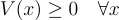

# Lyapunov_Control_Ecosystem
Lyapunov Control of Predator_Prey_Food Ecosystem

---

## Problem Description

We simulate and control a simplified ecosystem using a dynamical systems framework. The ecosystem consists of three interacting populations:

- **Food (F)**: A renewable resource.  
- **Prey (P)**: Herbivores that consume food.  
- **Predators (R)**: Carnivores that consume prey.  

Our objective is to control this system using feedback such that the state $(F, P, R)$ converges to a desired target equilibrium.

---

## State Space Description

The system's state is described by the vector:

$$
x = \begin{bmatrix} f \\ 
p \\ 
r \end{bmatrix}
$$

Where:
- $f$: amount of food,
- $p$: number of prey,
- $r$: number of predators.

---

## Action Space Description

The control action vector $u \in \mathbb{R}^3$ is defined as:

$$
a = \begin{bmatrix} a_1 \\ 
a_2 \\ 
a_3 \end{bmatrix}
$$

Where:
- $a_1$: control input to influence food supply,
- $a_2$: control input to influence prey population,
- $a_3$: control input to influence predator population.

---

## System Dynamics

The dynamics are modeled as a set of nonlinear differential equations:

$$
\begin{aligned}
\frac{df}{dt} &= kf - \alpha p + a_1 \\
\frac{dp}{dt} &= \beta fp - \gamma r + a_2 \\
\frac{dr}{dt} &= \delta pr - \mu r + a_3 \\
\end{aligned}
$$

Where:
- $k$: food influx rate,
- $\alpha$: rate of food consumption by prey,
- $\beta$: prey growth efficiency due to food,
- $\gamma$: predation rate,
- $\delta$: predator growth efficiency due to prey,
- $\mu$: predator death rate.

---

## Lyapunov-Based Control

To stabilize the system to a desired target state , we employ Lyapunov-based control. The Lyapunov function is chosen as a quadratic energy function:

In our implementation, we use the **identity matrix** for $Q$, which simplifies the Lyapunov function to:

---

### Properties of the Lyapunov Function

1. **Positive Semi-Definite**:  

   

   with equality if and only if $x = x^*$.

2. **Time Derivative of the Lyapunov Function**:

   Let $e = x - x^*$. Then the derivative is:

   
   

   The controller is designed so that $\dot{V}(x) \leq 0$, which ensures stability and convergence to the equilibrium point.

---

## Controller and Class Structure

The system is implemented using a modular, class-based structure with clear responsibilities:

---

### `Plant` and `Ecosystem`

- **`Plant`**: An abstract base class defining the template for a general dynamical system. It contains basic state handling and a `step` method to evolve the system forward in time, which must be implemented in subclasses.
  
- **`Ecosystem`**: A concrete subclass of `Plant` implementing the specific nonlinear dynamics of a food-prey-predator ecosystem. The dynamics equations follow the form:

$$
\begin{aligned}
\dot{f} &= kf - \alpha p + a_1 \\
\dot{p} &= \beta fp - \gamma r + a_2 \\
\dot{r} &= \delta pr - \mu r + a_3
\end{aligned}
$$
  

The method `system_dynamics` computes the derivatives given the current state and control inputs, while `step` updates the state using Euler integration.

---

### `EnergyController`

- Implements the **feedback linearization** strategy derived in the Lyapunov-based stability analysis.
- It defines the control law in `get_action`, which cancels nonlinear dynamics and applies linear stabilizing feedback:
  
$$
\begin{aligned}
u_1 &= -kf + \alpha p - \tilde{f} k \\
u_2 &= -\beta f p + \gamma r - \tilde{p} \beta \\
u_3 &= -\delta p r + \mu r - \tilde{r} \mu
\end{aligned}
$$

where $\tilde{f}, \tilde{p}, \tilde{r}$ are deviations from target state. These control inputs ensure $\dot{V} = -k \tilde{f}^2 - \beta \tilde{p}^2 - \mu \tilde{r}^2 \leq 0$.

- It also includes a Lyapunov function for monitoring convergence.

---

### `Simulation` Class

- Responsible for running the system dynamics over time under the influence of a controller.
- The `run` method iteratively:
  - Retrieves control actions from the controller.
  - Applies them to the `Plant` via the `step` method.
  - Records system states and actions.

- Outputs the entire trajectory of system evolution and corresponding control inputs.

---

### `Animator_ImageIO_Proc` Class

- Provides a **parallelized animation pipeline** using `ProcessPoolExecutor`.
- Key methods:
  - `create_and_save_frame`: Renders a frame with state and action plots.
  - `generate_frames_parallel`: Efficiently generates frames in parallel to accelerate rendering.
  - `create_gif`: Assembles all saved PNG frames into a GIF using `imageio`.
  - `animate`: Full animation workflow — generates frames, assembles them, and displays the result.

This design allows for scalable and efficient visualization of long simulations with high-resolution dynamics.

---

### Summary of the Pipeline

The full system integrates theoretical Lyapunov-based control with a robust simulation and animation pipeline:

1. **Modeling**: Define nonlinear dynamics in `Ecosystem`.
2. **Control**: Use `EnergyController` to compute feedback-linearized control actions.
3. **Simulation**: Run closed-loop control using the `Simulation` class.
4. **Visualization**: Render trajectory evolution with parallel frame generation and animation via `Animator_ImageIO_Proc`.

This structured approach makes it easy to experiment with different control laws, parameter settings, and target behaviors, while providing a rich visual understanding of the system's convergence properties.

---

# Control law derivation

---

## Lyapunov Function Definition

We define the Lyapunov function as a simple sum of squared state variables:

$$
V = \frac{1}{2}(x_1^2 + x_2^2 + x_3^2) = \frac{1}{2}(f^2 + p^2 + r^2)
$$

where 
$
x= 
\begin{bmatrix}
f \\ 
p \\ 
r \end{bmatrix}
$ 
is the current state of the system.

---

## Lyapunov Function Derivative

To analyze system stability, we compute the time derivative of $V$:

$$
\dot{V} = f \dot{f} + p \dot{p} + r \dot{r}
$$

Substitute in the system dynamics (without control yet):

$$
\begin{aligned}
\dot{f} &= kf - \alpha p \\
\dot{p} &= \beta f p - \gamma r \\
\dot{r} &= \delta p r - \mu r \\
\end{aligned}
$$

Then:

$$
\begin{aligned}
\dot{V} &= f(kf - \alpha p) + p(\beta fp - \gamma r) + r(\delta pr - \mu r) \\
&= f^2 k - f p \alpha + \beta f p^2 - \gamma p r + \delta p r^2 - \mu r^2 \\
\end{aligned}
$$

---

## Reformulation for Nonzero Target State

Let:

$$
\tilde{f}=f-f^* \,
\tilde{p}=p-p^* \,
\tilde{r}=r-r^*
$$

Define Lyapunov function for deviation from the target:

$$
V = \frac{1}{2}(\tilde{f}^2 + \tilde{p}^2 + \tilde{r}^2)
$$

Then the time derivative becomes:

$$
\dot{V} = \tilde{f} \dot{f} + \tilde{p} \dot{p} + \tilde{r} \dot{r}
$$

With control included:

$$
\begin{aligned}
\dot{f} &= kf - \alpha p + a_1 \\
\dot{p} &= \beta f p - \gamma r + a_2 \\
\dot{r} &= \delta p r - \mu r + a_3 \\
\end{aligned}
$$

Now expand the derivative:

$$
\begin{aligned}
\dot{V} &= \tilde{f}(kf - \alpha p + a_1) + \tilde{p}(\beta f p - \gamma r + a_2) + \tilde{r}(\delta p r - \mu r + a_3) \\
&= \tilde{f} k f - \tilde{f} \alpha p + \tilde{f} a_1 + \tilde{p} \beta f p - \tilde{p} \gamma r + \tilde{p} a_2 + \tilde{r} \delta p r - \tilde{r} \mu r + \tilde{r} a_3
\end{aligned}
$$

To ensure $\dot{V} \leq 0$, we choose control actions that cancel out the positive components.

## Detailed Expansion of Lyapunov Derivative

We previously wrote the derivative of the Lyapunov function as:

$$
\dot{V} = \tilde{f}(kf - \alpha p + a_1) + \tilde{p}(\beta f p - \gamma r + a_2) + \tilde{r}(\delta p r - \mu r + a_3)
$$

### Step 1: Expand all nonlinear terms

Label and group the **nonlinear dynamics**:

- $\tilde{f} \cdot kf$ is nonlinear (bilinear in $\tilde{f}, f$),
- $-\tilde{f} \cdot \alpha p$,
- $\tilde{p} \cdot \beta f p$,
- $-\tilde{p} \cdot \gamma r$,
- $\tilde{r} \cdot \delta p r$,
- $-\tilde{r} \cdot \mu r$

So:

$$
\begin{aligned}
\dot{V} &= \underbrace{\tilde{f}(kf - \alpha p) + \tilde{p}(\beta f p - \gamma r) + \tilde{r}(\delta p r - \mu r)}_{\text{Nonlinear system dynamics}} + \tilde{f} a_1 + \tilde{p} a_2 + \tilde{r} a_3
\end{aligned}
$$

---

## Step 2: Define control actions to cancel nonlinear terms

We now apply **feedback linearization** — design control inputs $a_i$ that cancel the nonlinear parts:

$$
\begin{aligned}
a_1 &= -kf + \alpha p - \tilde{f} k \\
a_2 &= -\beta f p + \gamma r - \tilde{p} \beta \\
a_3 &= -\delta p r + \mu r - \tilde{r} \mu
\end{aligned}
$$

Now substitute into $\dot{V}$:

$$
\dot{V} = \tilde{f} a_1 + \tilde{p} a_2 + \tilde{r} a_3 + \text{nonlinear terms}
$$

But the nonlinear terms cancel **exactly** with the first part of each $a_i$, so only the last damping terms remain:

$$
\begin{aligned}
\dot{V} &= \tilde{f} (-\tilde{f} k) + \tilde{p} (-\tilde{p} \beta) + \tilde{r} (-\tilde{r} \mu) \\
&= -k \tilde{f}^2 - \beta \tilde{p}^2 - \mu \tilde{r}^2
\end{aligned}
$$

---

## Step 3: Applying control laws

The time derivative of the Lyapunov function becomes:

$$
\dot{V} = -k \tilde{f}^2 - \beta \tilde{p}^2 - \mu \tilde{r}^2 \leq 0
$$

This is a **negative semi-definite** function. Each term is quadratic in the deviation and scaled by positive constants.

✅ Therefore, the system is globally stable under this control law.

---

## Result: stable system

This approach is a classic **feedback linearization** technique:

- The original nonlinear system dynamics are canceled exactly by the first term in each control input.
- The remaining control part adds a **linear damping** based on the distance to the goal.
- As a result, the system behaves like a stable linear system around the target state.

This technique ensures that the Lyapunov function decreases over time, proving **asymptotic convergence to the target state**.

---

## Simulation results

We've made several runs of our code on different trajectories, all corresponding gifs can be found in master branch.

### No control applied

Without control, system diverges, and both prey and predators are eventually extincted.

### Control applied

With control, we can reach any target state. And, it is important, that controls, applied to reach this target state, are achievable.

### Control applied

Another example of successfull convergence to target state, with achievable control actions. However, controls depend on state variables, so with bigger system controls will also grow significantly.

## Phase Portrait

We obtaied 3D Phase Portrait of the system, showing global convergence to target state from any (positive) initial state.

